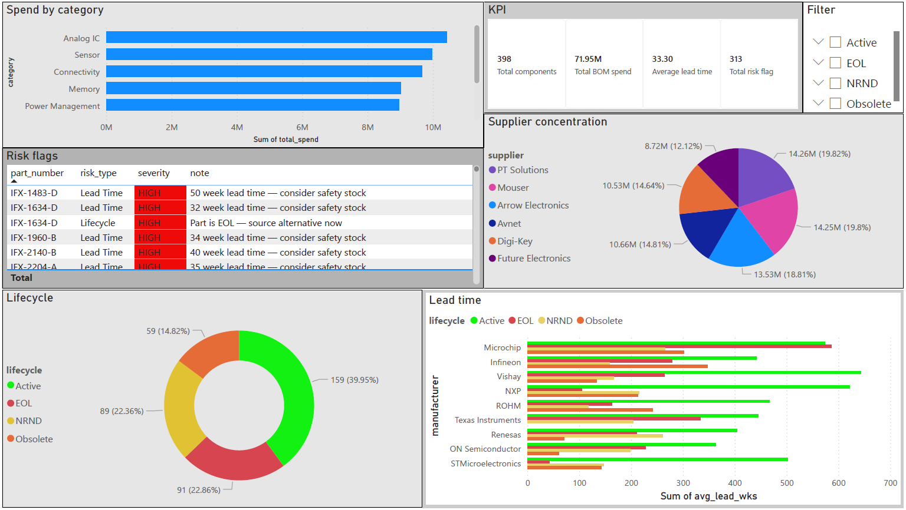

# Semiconductor BOM Supply Chain Analytics

---

## Project Overview

An end-to-end data analysis pipeline that ingests a Bill of Materials (BOM),
stores it in a relational database, runs supply chain risk analysis, and
exports clean datasets for Power BI and Tableau dashboards.

---

## Tech Stack

| Layer       | Tool                  |
|-------------|----------------------|
| Ingestion   | Python 3 + Pandas     |
| Storage     | SQLite (swap for PostgreSQL in production) |
| Analysis    | SQL + Pandas          |
| Dashboard   | Power BI / Tableau    |

---

## How to Run

```bash
# 1. Install dependencies
pip install pandas

# 2. Run the pipeline
python bom_analysis.py

---

## Power BI Dashboard


| Visual         | Fields                              |
|----------------|--------------------------------------|
| KPI Cards      | total_parts, total_spend, at_risk %  |
| Bar Chart      | total_spend by category              |
| Pie/Donut      | part_count by lifecycle              |
| Table          | High-risk parts with conditional fmt |
| Treemap        | spend by industry + category         |
| Supplier Risk  | spend_pct by supplier (flag >30%)    |

---

## Key Findings using sample data

- 47% of components are at risk (141 out of 300 are NRND, Obsolete, or EOL)
- EOL and Obsolete parts average 44–45 week lead times vs 28 weeks for Active parts
- Connectivity and Analog IC are the highest spend categories (~$7.5M each), not Power Management
- PT Solutions and Mouser are the top suppliers by spend (22% and 19% respectively)
- 313 risk flags generated — some parts flagged for both lifecycle AND lead time issues
- One EOL part (IFX-3880-A) has a **64-week lead time** — critical sourcing action needed
---

